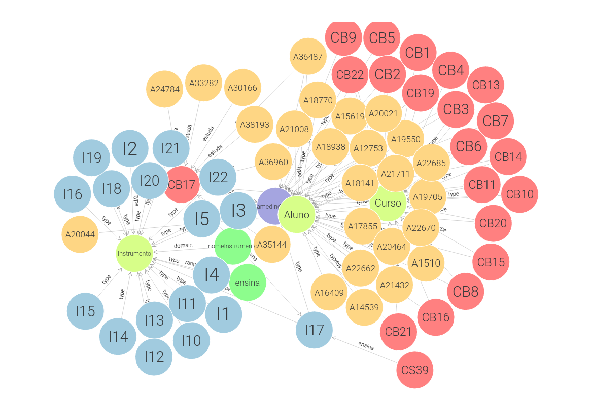

## TPC2

Classes:
- Aluno, Curso, Instrumento

Object Properties:
- estuda (Alunos ->  Curso), ensina (Curso -> Instrumento)

Data Properties:
- Aluno: dataNascimento, nomeAluno, anoCurso
- Curso: designacao, duracao
- Instrumento: nomeInstrumento

#### Ontologia no GraphDB
